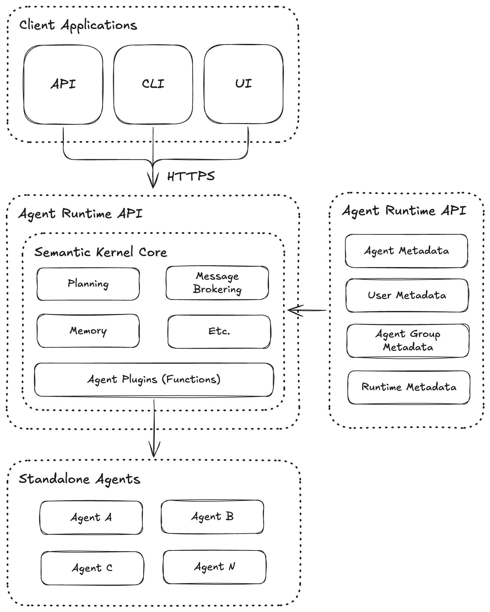

# Agent Runtime Architecture



## Three-Tier Architecture

The system is built with a clear separation of concerns across three distinct layers:

### 1. Client Layer (CLI & Future Web Clients)
- **Command-line Interface**: Interactive console for user interaction
  - Provides natural language interface for queries
  - Handles display formatting and user experience
  - Implements streaming output for real-time response viewing
  - Maintains consistent UI patterns with "you → " for user inputs and "runtime → " for system responses
- **Web Client**: (Potential future addition) Browser-based interface

### 2. API Layer (FastAPI)
- **REST API**: Clear communication boundary between clients and runtime
  - Exposes standardized endpoints for queries, group chat, and admin operations
  - Handles streaming responses via Server-Sent Events (SSE)
  - Provides a stable contract for any client implementation
  - Maintains backward compatibility for clients

### 3. Runtime Layer (Semantic Kernel)
- **Core Logic**: Orchestration of agent interactions 
  - Processes queries through Semantic Kernel
  - Manages agent registration and invocation
  - Implements streaming for real-time LLM output
  - Maintains conversation history and context
- **Agent Registry**: External service providing configuration and metadata
  - Acts as a central repository independent of the runtime
  - Provides agent discovery and capability information to the runtime
  - Enables dynamic updates to agent configurations without runtime restart
  - Supports multiple runtime instances with consistent agent data

## Streaming Implementation

The system now features full end-to-end streaming capabilities:

1. **Runtime**: Semantic Kernel streaming integration
   - Uses `get_streaming_chat_message_content()` to stream LLM responses chunk by chunk
   - Each token/chunk from the LLM is immediately passed to an event queue

2. **API**: Server-Sent Events (SSE)
   - The FastAPI layer converts runtime events to SSE format
   - Maintains open connection to clients while streaming content
   - Properly formats chunks with metadata for client processing

3. **CLI**: Real-time display
   - Processes SSE streams from the API
   - Displays content chunks as they arrive for a responsive user experience
   - Shows agent calls and responses in real-time with proper formatting
   - Uses intuitive "you → " and "runtime → " format for clear conversation flow

The streaming implementation ensures that:
- Users see responses as they're generated (token by token)
- Agent calls are visible in real-time with the "ƒ(x)" notation
- The system feels responsive even during longer computations

## Component Descriptions

### Client Applications
- **Command-line Interface**: Interactive terminal-based client for testing and demo purposes
  - Now with `make interactive` command that automatically ensures all components are running
  - Provides commands for listing agents, viewing conversation history, and more
  - Improved UI with consistent "you → " and "runtime → " formatting for all interactions
- **Web Client**: (Potential future addition) Browser-based interface

### Semantic Kernel Runtime
- **FastAPI REST Interface**: Exposes runtime capabilities via HTTP endpoints
  - `/api/query` - Process natural language queries
  - `/api/group-chat` - Multi-agent coordination
  - `/api/conversations/{id}` - Chat history retrieval
  - `/api/agents` - List available agents
- **Semantic Kernel Core**: 
  - **Agent Plugins**: Wraps agent endpoints as SK plugins/functions
  - **Function Calling**: Uses Semantic Kernel's function calling capabilities to determine which agent(s) to call
  - **OpenAI Service**: Handles LLM interactions with streaming support
  - **Conversation Store**: Maintains conversation history using Semantic Kernel's ChatHistory

### Agent Registry
- **External Service**: Operates independently from the runtime
  - Provides a central source of truth for agent configurations
  - Enables runtime to dynamically discover and interact with agents
  - Can be shared across multiple runtime instances
- **Agent Metadata Repository**: Stores detailed information about each agent
  - Capabilities, supported parameters, and interaction patterns
  - Version information and status tracking
  - Access control and authentication requirements
- **Agent Groups Management**: Defines and manages collections of agents
  - Preconfigured combinations for specific tasks
  - Coordination patterns between complementary agents
  - Parallel vs. sequential execution policies
- **Runtime Configuration Store**: Centralized configuration management
  - Environment-specific settings and connection details
  - Scaling parameters and resource allocation settings
  - LLM provider configurations and fallback strategies

### Standalone Agents
- **Multiple Independent Agents**: Any number of agents can be registered
- **Technology Agnostic**: Agents can be implemented in any language or framework
- **Independent Deployment**: Each agent operates as a standalone service
- **Capability Based**: Agents expose specific capabilities to the registry

## Message Flow

1. User sends a query to the runtime API (directly or via CLI)
2. Runtime creates a ChatHistory with the user's query and conversation context
3. Runtime consults the Agent Registry to discover available agents and their capabilities
4. Runtime uses Semantic Kernel's function calling to determine which agent(s) to call
5. If agent calls are needed, the runtime streams the agent call events to the client
6. Agent responses are streamed back to the client as they arrive
7. LLM response from Semantic Kernel is streamed token by token to the client
8. Conversation history is updated in the runtime's storage

## User Experience Improvements

The system now features a more polished and responsive user interface:

1. **Consistent Formatting**
   - User inputs are consistently preceded by "you → "
   - Runtime responses are preceded by "runtime → "
   - Agent interactions are displayed in a conversational format showing exchanges:
     ```
     talking with the agent(s):
      ↪ runtime to agent-id → query
      ↪ agent-id to runtime → response
     ```

2. **Real-time Streaming**
   - All responses appear token by token as they're generated
   - Agent calls and responses are visible immediately
   - No waiting for complete responses before seeing output

3. **Clear Separation**
   - The system clearly shows which component is responding
   - Users can easily distinguish between runtime responses and agent responses
   - The flow of information is transparent and intuitive

## Semantic Kernel Integration

The system uses Semantic Kernel's function calling capabilities to determine which agents to call based on the query:

1. **Agent Registration**: Agents are registered as functions with the Semantic Kernel
2. **ChatHistory**: The system uses Semantic Kernel's ChatHistory class to maintain conversation history
3. **PromptExecutionSettings**: The system uses Semantic Kernel's PromptExecutionSettings to configure function calling behavior
4. **Streaming Support**: Leverages Semantic Kernel's streaming capabilities for real-time responses

## Extensibility

Adding new agents is simple:
1. Create a new standalone agent with a REST endpoint
2. Add the agent's configuration to agents.json
3. Restart the runtime

The runtime will automatically load the new agent's configuration and register it as a Semantic Kernel plugin.

## CLI Interface Features

The CLI interface (`runtime.py`) provides the following capabilities:
- Interactive conversation with the agent runtime
- Listing available agents and their capabilities (`agents` command)
- Viewing conversation history and agent interactions
- Intuitive, user-friendly terminal interface with streaming responses
- Consistent formatting for user inputs and system outputs

The Makefile provides several ways to launch the CLI:
- `make interactive` - One-command solution that checks/starts all required services
- `make cli` - Starts only the CLI interface (assumes services are running)
- `make runtime-cli` - Runs the runtime in the foreground with visible logs (for development)

- Agent interactions are displayed in a conversational format:
  ```
  talking with the agent(s):
   ↪ runtime to agent-id → query
   ↪ agent-id to runtime → response
  ``` 